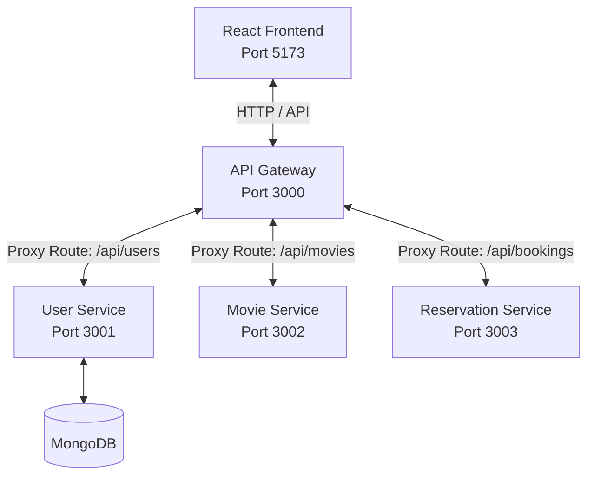

# Movie Reservation System

A modern microservices-based Movie Reservation System built with React, Express, and Docker. The system provides user authentication (local & Google OAuth), movie catalogs, seat reservation grids, and ticket booking tracking.

---

## Architecture Overview



### Components
1.  **Frontend**: Built with Vite and React. Handles user authentication state, catalog browsing, seat maps, and reservations.
2.  **API Gateway**: Built with Node.js and Express. Serves as a single entry point, managing CORS and proxying requests to internal services using `http-proxy-middleware`.
3.  **User Service**: Manages accounts, token-based authentication (JWT rotation & refresh), password resets, and audit logs. Connects to MongoDB.
4.  **Movie Service**: Manages the catalog of movies, theaters, screen layouts, and showtimes *(under development)*.
5.  **Reservation Service**: Manages active bookings, ticket generation, seat locks, and payments *(under development)*.

---

## Technology Stack

-   **Frontend**: React (18), React Router Dom (6), Axios, CSS Variables.
-   **Backend Services**: Node.js, Express (4/5), Mongoose (MongoDB).
-   **Security**: Helmet, Express Rate Limit, Parameter Pollution prevention (hpp), XSS-clean, NoSQL Query Injection sanitization, and Bcrypt hashing.
-   **Orchestration**: Docker & Docker Compose.

---

## Service Endpoints & Port Mappings

| Service Name | Local Port | Docker Container | Internal API Path | Exposed Routes |
| :--- | :--- | :--- | :--- | :--- |
| **API Gateway** | `3000` | `movie-reservation-api-gateway` | `/api/*` | `/health` |
| **Frontend** | `5173` | `movie-reservation-frontend` | N/A | React Router pages |
| **User Service** | `3001` | `movie-reservation-user-service` | `/api/v1/users` | Registration, Login, OAuth, Password Reset, `/me` |
| **Movie Service** | `3002` | `movie-reservation-movie-service` | `/api/v1/movies` | *Placeholder* |
| **Reservation Service** | `3003` | `movie-reservation-reservation-service` | `/api/v1/bookings` | *Placeholder* |

---

## Quick Start Setup (Docker Compose)

The entire microservice mesh can be spun up locally using Docker Compose.

### 1. Configure Environment Variables
Create a `.env` file in the root directory. You can copy the template:
```bash
cp .env.example .env
```
Ensure you create or edit service-specific environments where needed (e.g., `services/user-service/config.env`).

### 2. Run the Containers
Start all containers in development mode with volume mounts and hot-reloads:
```bash
docker compose up --build
```

Once running:
-   **Frontend**: Navigate to `http://localhost:5173`
-   **API Gateway Health**: Visit `http://localhost:3000/health`
-   **User Service Health**: Visit `http://localhost:3001/health`

### 3. Common Management Commands
```bash
docker compose down                  # Stop and remove containers
docker compose logs -f               # Stream logs for all services
docker compose logs -f user-service  # Stream logs for user service only
docker compose ps                    # List running containers
```

---

## Development & Configuration

### MongoDB Connection Setup
The User Service requires a MongoDB instance. 
-   **Local Host Development**: By default, it connects to a local MongoDB instance at `mongodb://127.0.0.1:27017/user-service`.
-   **Docker Development**: Ensure a MongoDB container is running or specify your cloud MongoDB Atlas connection string in `services/user-service/config.env`.

### Google OAuth Integration
To enable Google Sign-In, configure these variables in the User Service env file:
```env
GOOGLE_CLIENT_ID=your-google-client-id
GOOGLE_CLIENT_SECRET=your-google-client-secret
GOOGLE_CALLBACK_URL=http://localhost:3001/api/v1/users/auth/google/callback
```

---

## Project Structure

```
├── api-gateway/          # Express reverse-proxy gateway
├── frontend/             # React + Vite application
├── services/
│   ├── user-service/     # Core user, auth & security service
│   ├── movie-service/    # Catalog & showtimes service (placeholder)
│   └── reservation-service/ # Booking & payment service (placeholder)
├── docker-compose.yml    # Main development orchestration config
└── README.md
```
